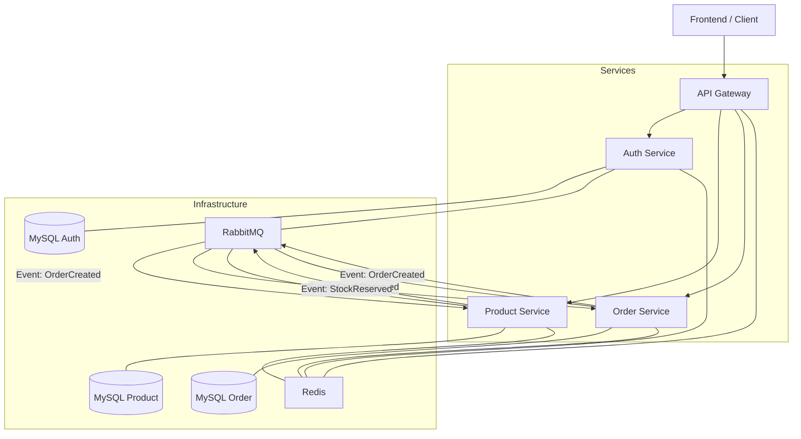

# Modular E-commerce Platform

A modern, microservices-based e-commerce platform built with Laravel, featuring an API Gateway, Auth Service, Product Service, and Order Service.

## Architecture Overview

The project follows a microservices architecture where each service is responsible for a specific domain. Communication between services is handled via REST and RabbitMQ (events).

### Microservices Diagram



## Microservices

- **[API Gateway](./api-gateway/README.md)**: Entry point for clients. Handles JWT validation and routing.
- **[Auth Service](./auth-service/README.md)**: Manages users and authentication.
- **[Product Service](./product-service/README.md)**: Manages product catalog and inventory/stock reservations.
- **[Order Service](./order-service/README.md)**: Manages order lifecycle and transactions.
- **Frontend**: A Vite-based frontend application.

## Infrastructure

- **Docker Compose**: Orchestrates all services and infrastructure.
- **RabbitMQ**: Message broker for asynchronous inter-service communication. Uses the Transactional Outbox pattern for reliable delivery.
- **Redis**: Shared cache and session store, also used for API throttling.
- **MySQL**: Dedicated database for each service (Auth, Products, Orders).

## Getting Started

### Prerequisites
- Docker & Docker Compose
- Make (optional, but recommended)

### Installation

1. Clone the repository.
2. Run the initialization script:
   ```bash
   make init
   ```
3. Build and start the services:
   ```bash
   make build
   make up
   ```
4. Seed the databases:
   ```bash
   make seed
   ```

## Makefile Commands

| Command | Description |
|---------|-------------|
| `make init` | Runs `scripts/init.sh` to initialize the project (env files, etc.) |
| `make up` | Starts all services and workers in detached mode |
| `make down` | Stops all services and workers |
| `make build` | Builds/Rebuilds docker images |
| `make logs` | Follows logs from all containers |
| `make composer service=...` | Runs `composer install` in the specified service |
| `make seed` | Runs `scripts/seed.sh` to populate databases with demo data |
| `make test` | Runs the full test suite via `scripts/run-tests.sh` |
| `make check` | Runs static analysis (PHPStan, Pint, Psalm) for all services |
| `make fix-frontend` | Automatically fixes linting/formatting issues in the frontend |

## Testing

The project includes Feature and E2E tests. Testing is orchestrated by the `scripts/run-tests.sh` script, which:
1. Sets up a dedicated test environment (separate docker containers/databases).
2. Waits for all infrastructure to be healthy.
3. Runs migrations and seeds for the testing environment.
4. Executes PHPUnit tests across all services.

Run tests with:
```bash
make test
```

## Scripts

- `scripts/init.sh`: Project setup and environment file creation.
- `scripts/seed.sh`: Orchestrates seeding across multiple microservices.
- `scripts/run-tests.sh`: Robust test runner with environment isolation.
- `scripts/check.sh`: Runs static analysis and linting checks.
