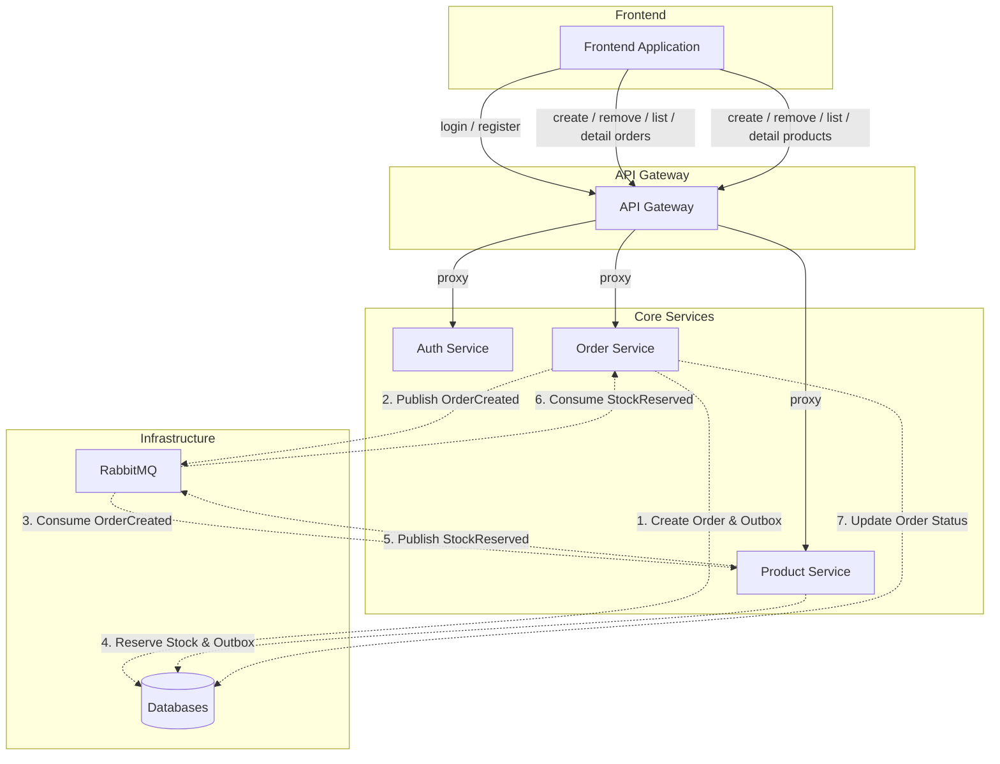

# Modular E-commerce Platform

A modern, microservices-based e-commerce platform built with Laravel, featuring an API Gateway, Auth Service, Product Service, and Order Service.

## Architecture Overview

The project follows a microservices architecture where each service is responsible for a specific domain. Communication between services is handled via REST and RabbitMQ (events).

### Microservices Diagram



## Order Creation Workflow

The platform uses an asynchronous, event-driven approach for order processing to ensure consistency across microservices:

1.  **Frontend**: Sends a create order request to the **API Gateway**.
2.  **API Gateway**: Proxies the request to the **Order Service**.
3.  **Order Service**: 
    - Validates the request.
    - Creates an order in `PENDING` state.
    - Records an `OrderCreated` event in its **Transactional Outbox**.
4.  **Relay (Worker)**: A background job picks up the event from the outbox and sends it to **RabbitMQ**.
5.  **Product Service**: 
    - Listens for `OrderCreated` events.
    - Reserves the requested stock in its database.
    - Records a `StockReserved` event in its **Transactional Outbox**.
6.  **Relay (Worker)**: A background job picks up the event and sends it to **RabbitMQ**.
7.  **Order Service**:
    - Listens for `StockReserved` events.
    - Updates the order status to `CONFIRMED` (or `FAILED` if stock was unavailable).

## Documentation

The API documentation is automatically generated using [Scramble](https://scramble.dedoc.co/).

- **URL**: `/docs/api` (accessible on the API Gateway)
- **Generation**: The documentation can be built using the following command:
  ```bash
  make docs-build
  ```

## Microservices

- **[API Gateway](./api-gateway/README.md)**: Entry point for clients. Handles JWT validation and routing.
- **[Auth Service](./auth-service/README.md)**: Manages users and authentication.
- **[Product Service](./product-service/README.md)**: Manages product catalog and inventory/stock reservations.
- **[Order Service](./order-service/README.md)**: Manages order lifecycle and transactions.
- **Frontend**: A Vite-based frontend application.

## Infrastructure

- **Docker Compose**: Orchestrates all services and infrastructure.
- **RabbitMQ**: Message broker for asynchronous inter-service communication. Uses the Transactional Outbox pattern for reliable delivery.
- **Redis**: Shared cache and session store, also used for API throttling.
- **MySQL**: Dedicated database for each service (Auth, Products, Orders).

## Getting Started

### Prerequisites
- Docker & Docker Compose
- Make (optional, but recommended)

### Installation

1. Clone the repository.
2. Run the initialization command:
   ```bash
   make init
   ```
   > **Note:** `make init` will handle environment setup, start the containers, install dependencies, and run migrations. There is no need to run `make up` separately after `init`.

### Demo User

For testing purposes, a demo user is seeded during initialization:

- **Username**: `demo@example.com`
- **Password**: `password`

## Makefile Commands

| Command | Description |
|---------|-------------|
| `make init` | **Recommended.** Initializes and runs the project (envs, docker up, composer, migrations) |
| `make up` | Starts all services and workers in detached mode |
| `make down` | Stops all services and workers |
| `make build` | Builds/Rebuilds docker images |
| `make logs` | Follows logs from all containers |
| `make composer service=...` | Runs `composer install` in the specified service |
| `make seed` | Runs `scripts/seed.sh` to populate databases with demo data |
| `make test` | Runs the full test suite via `scripts/run-tests.sh` |
| `make docs-build` | Generates API documentation using Scramble |
| `make docs-clean` | Removes generated API documentation |
| `make docs-debug` | Generates API documentation with verbose debug output |
| `make check-frontend` | Runs linting, type checks, and format checks for frontend |
| `make fix-frontend` | Automatically fixes linting/formatting issues in the frontend |
| `make check-service service=...` | Runs PHPStan, Pint, and Psalm for a specific service |
| `make check` | Runs all static analysis checks for the whole project |
| `make check-fe` | Runs static analysis checks for the frontend |

## Testing

The project includes Feature and E2E tests. Testing is orchestrated by the `scripts/run-tests.sh` script, which:
1. Sets up a dedicated test environment (separate docker containers/databases).
2. Waits for all infrastructure to be healthy.
3. Runs migrations and seeds for the testing environment.
4. Executes PHPUnit tests across all services.

Run tests with:
```bash
make test
```

## Scripts

- `scripts/init.sh`: Project setup and environment file creation.
- `scripts/seed.sh`: Orchestrates seeding across multiple microservices.
- `scripts/run-tests.sh`: Robust test runner with environment isolation.
- `scripts/check.sh`: Runs static analysis and linting checks.
